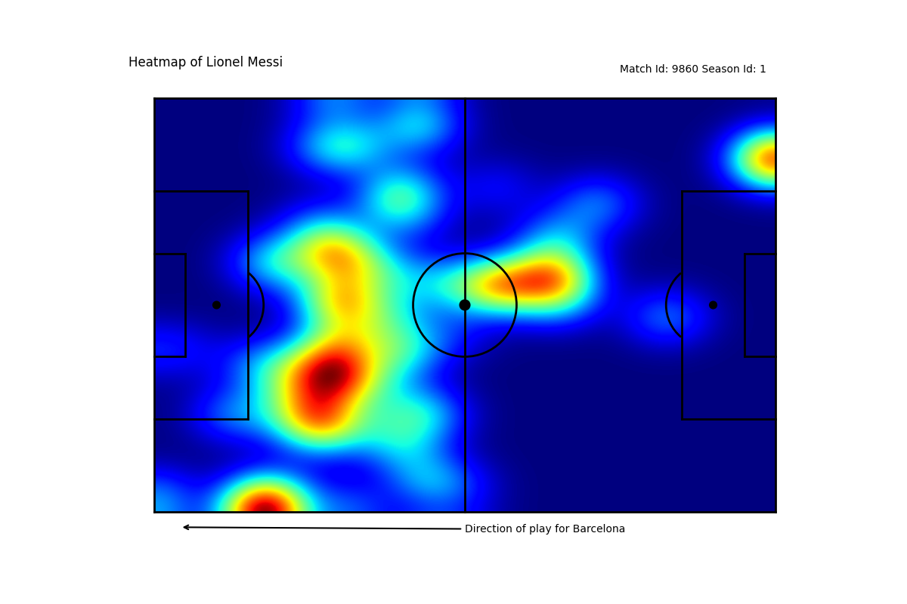
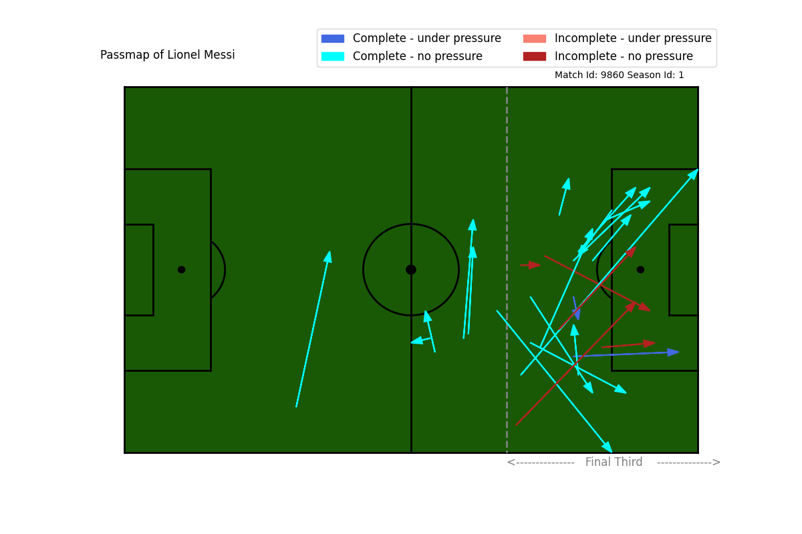
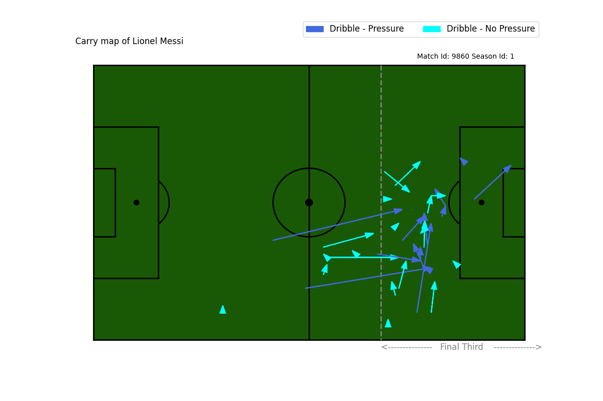
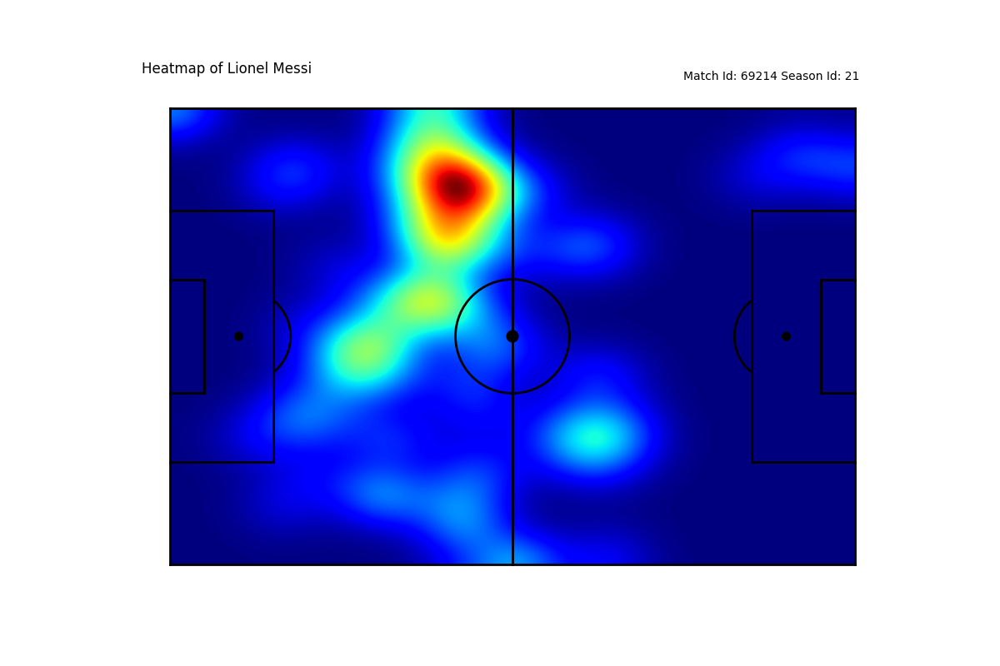
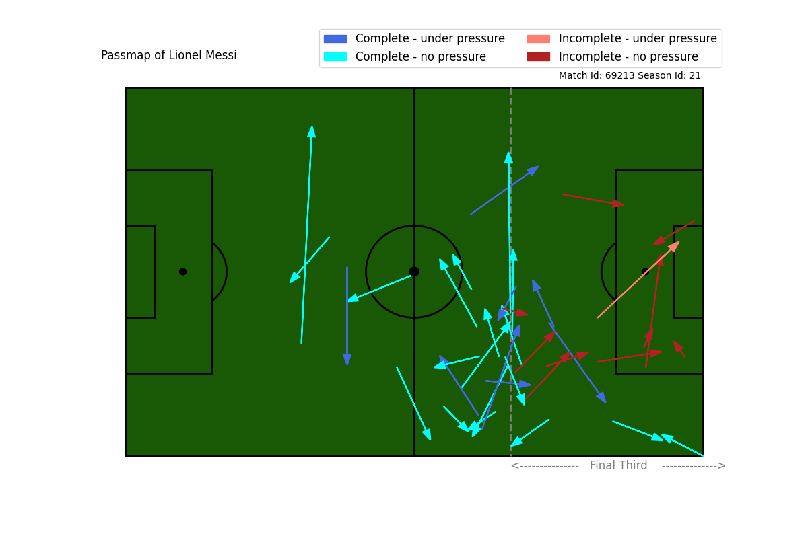
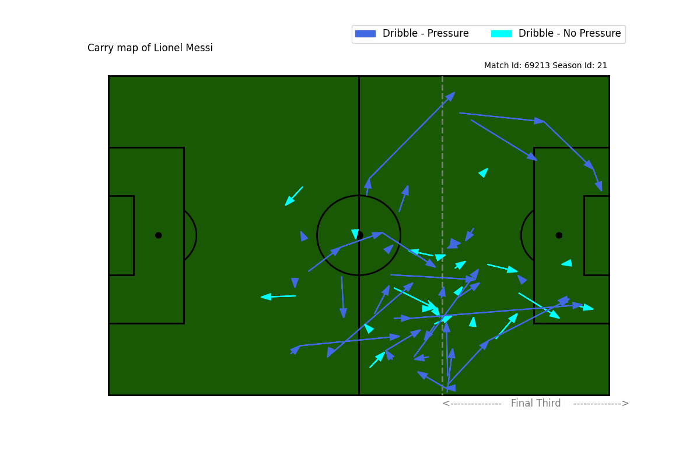

# Football Visualization

Using statsbomb public dataset. This dataset can be found at https://github.com/statsbomb/open-data.

Repo contains scripts to both visualize and get the data from the statsbomb github. Leverage data visualization to statistically analyze and visualize the performance of Lionel Messi. These scripts are written in Python 3 and are intended to be run with it.

### TODO
- [ ] Finish off passing network function
- [ ] Finish off function for calculting PPDA statistic for defensive pressure.
- [ ] Look more into 2011–12 season where he scored 73 goals in all comps.
- [ ] Train a model to recognize Lionel Messi based off a given set of statistics.
- [ ] Look into identifying players similiar to Lionel Messi through machine learning classification (KNN?).

## Getting Started

### 1. Clone Repo

`git clone https://github.com/Agile-Llama/Visualize-Football-Data`

### 2. Install Packages Required

Go in the directory of the repo and run:
```pip install -r requirements.txt```

#### 3. Expected Goals Explained

Throughout this project the term Expected goals is referenced (xG). A basic understanding of this stat is useful for full comprehenstion.  

Expected goals (xG) is a predictive model used to assess every goal-scoring chance, and the likelihood of scoring.

A xG model computes for each chance the probability to score based on what we know about it (event-based variables). The higher the xG - with 1 being the maximum, as all probabilities range between 0 and 1  - the higher the probability of scoring.  

In practice, that means if a chance has 0.2xG, it should be scored 20 per cent of the time. If it has 0.99xG, it should be converted 99 per cent of the time and so on. 

An easy example to understand is a penalty. When the penalty is awarded to a team, that team is given 0.76 expected goals. This is essentially saying that 76% of the time (on average) the penalty will be scored. 

Those with sence know that sports are not played on a spreadsheet and using the penalty example, one issue with xG is that it doesn't take into account the penalty taker or the goalkeeper.  
For example, someone like Fabinho has 95% conversion rate on penalties (17 taken) and someone like Lionel Messi has a 71% conversion rate.

See the links below for penalty stats used:  
https://www.transfermarkt.com/fabinho/elfmetertore/spieler/225693  
https://www.transfermarkt.com/lionel-messi/elfmetertore/spieler/28003


## What can you do?

### Get Game Events
- Inside the load_data.py script call the function all_events()  
  - This will return a csv file of all the events from all laliga seasons. 
  - csv file is saved in the working directory and is named 'df_messi'
  - This csv will contain the data for the games of the selected competition.
  - Also seperates out some data which isn't standard these are:
    - 'time' which is a column in the csv file which makes easier to see time played in a game.
    -  end_location_x and end_location_y for pass.
    -  end_location_x and end_location_y for carry.
    -  end_location_x and end_location_y for shot.

For all other attributes contained within the csv file see the statsbomb docs which are located in the root directory under 'Open Data Events V4.0.0.pdf'

## Looking into pressure and performance.

#### 1. Heat Map (High xG)
Currently the only options avaiable are either the lowest of highest expected goal game in a given season.  

Heat maps in Sport are used to identify the frequency of events spread in a given particular area.   
The map gets heated up in areas where the player has had more control of the ball and does most of his work, i.e it turns Redder as the player's presence in a particular area increases.



In the above image we can see that Lionel Messi spent the majority of his time in the false 9 position in the opponents half. This tracks as the game is one where he had the highest expected goals of that prticular season. 

#### 2. Pass Map (Basic) (High xG)

There a couple types of pass maps used in football. The more advanced one is furthur down this repository.  
The basic pass map just shows the x and y starting position and the x and y finishing position of a pass. Furthur information is given, whether the pass was incomplete, complete, underpressure or no pressure. 



- Note the flipped perspective of the above image. 

If we compare this pass map to the heat map above we can see the positions where Lionel Messi was most of the game was where the majority of his passes were. Not a particularly revolutionary discover. 

#### 3. Carry Map (High xG)
A carry in football is also known as a dribble. Apart from passing this is the other way to progress the ball.
A carry map is very similiar in concept to a pass map. It has the starting position (x, y) and the ending position of the carry. 



Much like the other 2 images we can see that messi spent the majority of his time around the false 9 position.

#### 4. Comparison between high and low xG games. 

So far i've only shown games which Lionel Messi has done well in (higher xG). From the pass map and the carry map we can clearly see that very few his actions had pressure put on him by opponents. The positions in which he did have pressure are those where you would expect, such as entering the opponents box. Generally possession in the opponents final third means there will be more pressure on the player. 

The following images are games where Messi had his lowest xG game of the particular season. 


Most notable difference about the heat maps is how Messi is pushed out wider. This could be a symptom of the formation used, or could be due to the pressure in which the opponent put on him. 


The majority of the passes in the final third are incomplete and more passes outside of the final third are passes in which pressure has been put on. 


Finally we can see that the team which is Messi is playing against is a team which is pressing him. The idea of pressing is to put pressure on the ball with the intention of winning it back off of the opposition. By forcing the opposition to complete an action in a pressured atmosphere, every aspect of that action is made more difficult.  


  


